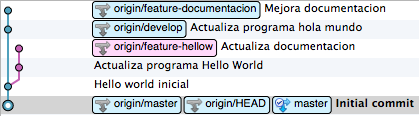

# Git Workshop

Repo para la charla de git workshop.

## Git Setup

Instrucciones para instalar y configurar la última versión estable de git.

### Instalación

Para instalar la última versión de git es necesario tener [homebrew][1] primero. Luego, basta con abrir un terminal y ejecutar lo siguiente:

    brew install git

Podemos verificar que contamos con la última versión ejecutando lo siguiente:

    git --version
    git version 1.8.5.2

Cualquier cosa por encima de `1.8.5` quiere decir que no estamos utilizando el binario provisto por defecto en OS X. 

### Configuración

Para setear el username y password de forma global:

    git config --global user.name gfestari

    git config --global user.email gaston.festari@mercadolibre.com

Reemplazar con las credenciales apropiadas ;)

## gitconfig

Configuración con algunos tweaks prácticos para mejorar el gitflow.

### Howto

**Este repo** cuenta con un archivo [gitconfig][2] de configuración con unos settings por defecto y aliases útiles para git.

La idea es que tomen prestado algunas de las configuraciones y aliases para hacer que el trabajo desde el terminal sea más sencillo.

#### Utilizar el script

El repo cuenta con un script que automatiza la copia del archivo de configuración de git. Para utilizarlo, basta con clonar el repo:

    git clone https://github.com/gfestari/workshop.git
    cd workshop

Y ejecutar el script `install.sh`, teniendo la precaución de haber actualizado previamente las las variables `username` e `email` con nuestras respectivas  credenciales de GitHub:

    username=gfestari
    email=gaston.festari@email.com

Guardar los cambios al script, y ejecutarlo de la siguiente manera:

    sh install.sh

Y listo.

#### Aliases

Algunos atajos prácticos que van a poder utilizar después de ésto:
<table>
  <tr>
    <th>comando</th><th>efecto</th>
  </tr>
<tr>
  <td>`git l`</td><td>log con grafo</td>
</tr>
<tr>
  <td>`git cm "Mensaje de commit"`</td><td>idem a realizar `git commit -m "Mensaje de commit"`</td>
</tr>
<tr>
  <td>`git news`</td><td>revisa qué cambios hay de nuevo en el repo</td>
</tr>
<tr>
  <td>`git d viejo nuevo`</td><td>diff para comparar archivos, commits, etc.</td>
</tr>
<tr>
  <td>`git pl`</td><td>`git pull --ff-only` una de las maneras indicada en el gitflow para hacer los `pull`</td>
</tr>
<tr>
  <td>`git s`</td><td>git status</td>
</tr>
<tr>
  <td>`git sb`</td><td>versión compacta de lo anterior</td>
</tr>
<tr>
  <td>`git stache`</td><td>versión hipster de `stash`</td>
</tr>
<tr>
  <td>`git alias`</td><td>imprime esta lista por extensión :P </td>
</tr>
</table>

#### Gitflow

Flujo de trabajo sujerido para utilizar git.

Remember:

* **NO HACER REESCRIBIR EL HISTÓRIAL PÚBLICO**
* **NO HACER `amend` DE COMMITS PUSHEADOS**
* **NO HACER `rebase` DE COMMITS PUSHEADOS**

##### Crear un topic branch 

Crea y cambia nuestra ref a un branch llamado `topic-branch`:

    git checkout -b topic-branch 

##### Actualizar HEAD con cambios upstream

Una vez hechos los cambios en `topic-branch`, podemos actualizar `develop` con los cambios de upstream:

    git checkout develop
    git pull --rebase origin develop

##### Replicar cambios upstream en branches locales

Con la ref al día de lo que sucede upstream, cambiamos a nuestro `topic-branch` para actualizarlo con los cambios que sucedieron en `develop`:

    git checkout feature-a
    git rebase -i develop

Con los cambios de `develop` replicados en nuestro `topic-branch` podemos continuar trabajando.

##### Merge de branches locales

Una vez completa la funcionalidad, volvemos a develop

    git checkout develop
    git merge feature-a
    
Y subimos los cambios al branch `develop` en upstream de la siguiente manera:
    
    git push origin develop

##### Eliminar branches locales

Finalmente, eliminamos el `topic-branch` que generamos localmente:

    git checkout -d topic-branch

Alternativamente, podemos utilizar el flag `-D` para eliminar un branch que no fue mergeado íntegramente:

    git checkout -D topic-branch

##### Eliminar branches remotos

Para eliminar un branch remoto compartido en el repo upstream, basta con ejecutar lo siguiente:

    git push origin :nombre_del_branch_eliminar

**CUIDADO** con los branches públicos compartidos que aún no han sido mergeados en `develop`.

##### Crear nuevos branches remotos

Muchas veces, interesa crear y compartir nuevos branches con el resto del equipo. 

De la siguiente manera, empujamos nuestro branch llamado `local-branch` a un remoto, bajo el nombre `remote-branch`:

    git push -u origin local_branch:remote_branch

##### Conectar branches upstream

Para crear y conectar un branch local con uno existente upstream, basta con ejecutar la siguiente línea:

    git checkout -b test origin/test

Esto crea y conecta el branch `test` con el remoto existente en `origin/test`

## SublimeText

Configuración de SublimeText 3 para utilizar desde la línea de comando y como `$EDITOR` por defecto del sistema.

### Command-line tools 

Esto permite utilizar el comando `subl` desde el terminal para invocar a SublimeText.

Generar el siguiente enlace simbólico desde un terminal:

    ln -s "/Applications/Sublime Text.app/Contents/SharedSupport/bin/subl"

### SublimeText como editor por defecto

Editar `~/.bashrc` - o `~/.zshrc` si utilizan zsh - y agregar la siguiente línea:

    export EDITOR='subl -w'

Alternativamente, pueden ejecutar la línea en el terminal para contar con una solución *temporal*.

## Homework

Generar un histórico lineal en el [repo de ejemplo][3] de @vierja para ello, deberían:

* Hacer un **[fork del repo][4]** 
* Corregir el histórico para lograr un grafo lineal (utilizar `rebase`, `merge` y `commit` según sea necesario) 
* Una vez que cuenten con el grafo lineal, **[hacer un pull request][5]** para proponer una respuesta al problema

[1]: http://brew.sh
[2]: https://github.com/gfestari/dotfiles/blob/master/prefs/gitconfig
[3]: https://github.com/vierja/workshop.git
[4]: https://help.github.com/articles/fork-a-repo
[5]: https://help.github.com/articles/using-pull-requests#initiating-the-pull-request
